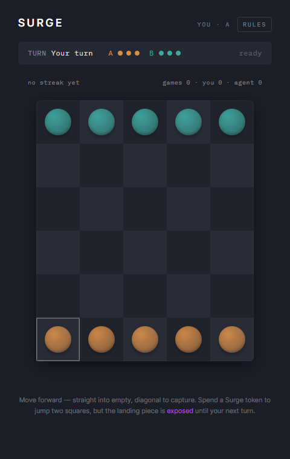

# Surge

[](https://github.com/chidhvilasa/surge/releases/latest)
[](LICENSE)
[](#download)

A 5x6 board strategy game with a self-improving AI opponent: a local Monte
Carlo Tree Search (UCB1) agent trained entirely through self-play, with no
external API calls or hosted services involved in any decision.



## Download

A Chrome extension build exists (see [`extension/`](extension/)) -- one
single package, not separate builds per OS. It runs inside Chrome itself,
not as native code, so the exact same file works identically on Windows,
Mac, Linux, and ChromeOS.

**Chrome Web Store** -- not live yet. Once published, this will be the
one-click install: identical on any OS, no manual steps. This section will
be updated with the real listing link the moment it's approved.

**Manual install (available now)** -- download the built extension
directly from the latest release and load it yourself:

[](https://github.com/chidhvilasa/surge/releases/latest)

This is a real manual install, not a one-click process -- Chrome blocks
installing `.crx` files directly outside the Web Store by design, for
security, so there's no smoother path around it today:

1. Download `surge-extension-vX.Y.Z.zip` from the
   [latest release](https://github.com/chidhvilasa/surge/releases/latest)
   and unzip it
2. Open `chrome://extensions` in Chrome
3. Turn on **Developer mode** (toggle, top right of that page)
4. Click **Load unpacked**
5. Select the unzipped `surge-extension` folder

Click the toolbar icon afterward to open the game in its own tab.

Full rules: [docs/SURGE_GAME_SPEC.md](docs/SURGE_GAME_SPEC.md)
Architecture notes: [docs/ARCHITECTURE.md](docs/ARCHITECTURE.md)

## Setup

```bash
python -m venv .venv
source .venv/Scripts/activate   # Windows Git Bash; use .venv/bin/activate on macOS/Linux
pip install -r requirements.txt
```

## Run the tests

```bash
python -m pytest backend/tests/ -v
```

## Play in the terminal (human vs human)

```bash
python backend/cli/play_terminal.py
```

## Stress-test the rules engine (random bot vs random bot)

```bash
python scripts/benchmark_random_bots.py --games 20000
```

## Train the MCTS agent

```bash
python backend/agent/train_self_play.py --games 200 --simulations 100
```

Policy is saved to `backend/agent/policy_store/mcts_policy.pkl` and reloaded
automatically on the next run, so skill accumulates across sessions.
Surge usage rate per game is logged to
`backend/agent/policy_store/training_log.csv` as a proxy metric for whether
the agent is learning to take calculated risks rather than playing purely
defensively.

`mcts_policy.pkl` is a regenerable build artifact, not checked into git (it's
large and machine-specific). To regenerate it from scratch:

```bash
python backend/agent/train_self_play.py --games 5000 --simulations 200 --save-every 500
```

### Difficulty tiers need two more policy files -- these are NOT disposable

`backend/agent/policy_store/easy_policy.pkl` and `medium_policy.pkl` are
required at server startup for the Easy/Medium difficulty tiers (see
`backend/api/main.py`). The server raises a `RuntimeError` and refuses to
start if either is missing. Despite sitting next to `mcts_policy.pkl` and
coming from the same training run, **do not treat these as throwaway
benchmark output** -- `scripts/benchmark_snapshots/` is for disposable
snapshots; these two specific files were promoted out of that directory
into permanent use as the Easy/Medium opponents.

If they ever go missing, regenerate the full snapshot series and copy the
right ones back in under these exact names:

```bash
python scripts/benchmark_snapshots.py --total-games 5000 --snapshot-every 500 --simulations 200
cp scripts/benchmark_snapshots/snapshot_500.pkl backend/agent/policy_store/easy_policy.pkl
cp scripts/benchmark_snapshots/snapshot_2000.pkl backend/agent/policy_store/medium_policy.pkl
```

Like `mcts_policy.pkl`, both are gitignored (large, machine-specific) -- not
checked into git, but required on disk for the server to run.

## Run the API

```bash
cd backend
python -m uvicorn api.main:app --reload --port 8000
```

Endpoints:

- `POST /games` — start a new game
- `GET /games/{game_id}` — fetch current board state
- `POST /games/{game_id}/move` — submit a human move (`from_pos`, `to_pos`, optional `move_type`)
- `POST /games/{game_id}/agent-move` — get the agent's response move

## Frontend

`frontend/` is populated separately: generate the visual layer with Lovable
(React, Tailwind, shadcn), pull the generated code into `frontend/`, and run
it locally with its own dev server, calling the FastAPI backend above on
`localhost:8000`. The Lovable project is a one-time generator, not a
live-synced dependency.

This Lovable export is a Bun project (`bun.lock`, `bunfig.toml`), not npm:

```bash
cd frontend
bun install
bun run dev
```
